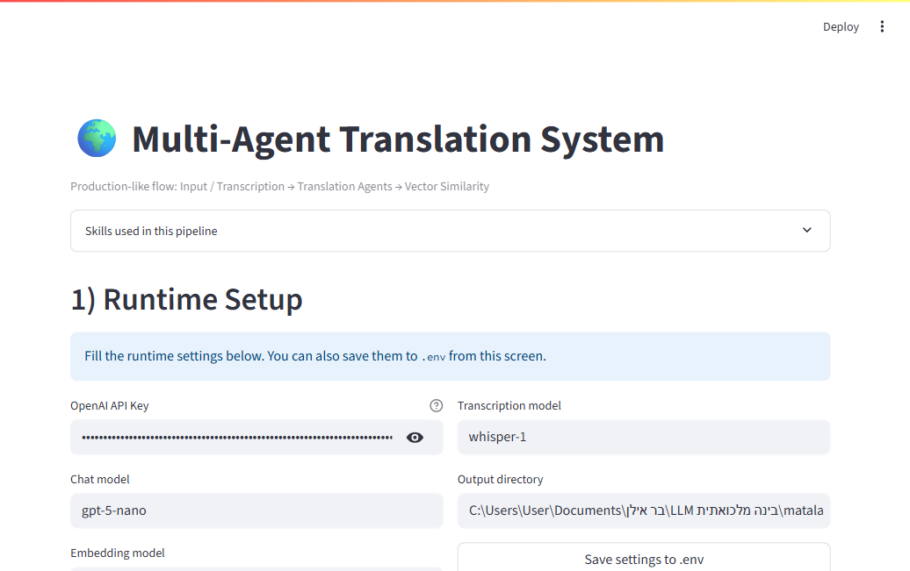

# Multi-Agent Translation Pipeline

## Project Goal
This project demonstrates a multi-agent AI pipeline that translates text through multiple languages and measures semantic drift using vector similarity.

Current pipeline:
- English -> French (Agent 1)
- French -> Hebrew (Agent 2)
- Hebrew -> English (Agent 3)
- Original English vs back-translated English vector comparison

The design is modular so language directions can be replaced later.

## Agent Pipeline
1. Read source text from `input/01_original.md`.
2. Agent 1 translates English to French and saves:
   - `output/02_french_translation.md`
3. Agent 2 translates French to Hebrew and saves:
   - `output/03_hebrew_translation.md`
4. Agent 3 translates Hebrew back to English and saves:
   - `output/04_back_to_english.md`
5. Comparison tool computes vector similarity and saves:
   - `output/05_vector_comparison_report.md`

## Project Structure
- `app_gui.py` - visual Streamlit system UI for full pipeline + optional audio transcription
- `run_pipeline.py` - manager agent/orchestrator for the full flow
- `src/pipeline.py` - shared pipeline logic used by CLI and GUI
- `src/config.py` - environment and model configuration
- `src/io_utils.py` - markdown read/write utilities
- `src/agents/base_translator.py` - shared translation agent base class
- `src/agents/en_to_fr_agent.py` - Agent 1
- `src/agents/fr_to_he_agent.py` - Agent 2
- `src/agents/he_to_en_agent.py` - Agent 3
- `src/tools/vector_compare.py` - embedding and cosine similarity comparison
- `skills/` - reusable prompt/skill specifications for advanced mode
- `input/` - source files
- `output/` - generated stage outputs and report
- `start_system.bat` - Windows launcher that collects ENV values and starts the GUI

## How Each Agent Works
Each translation agent:
1. Receives text from the previous stage.
2. Uses a direction-specific system prompt.
3. Calls the selected backend (OpenAI by default).
4. Returns only translated text to reduce formatting noise.

The agents are separate classes to keep responsibilities clear and support easy language swapping.

## How Vector Comparison Works
The comparison tool:
1. Loads the original English text and back-translated English text.
2. Converts both to vectors:
   - Preferred: OpenAI embeddings (`text-embedding-3-small`)
   - Fallback: local bag-of-words vectors (for offline/demo mode)
3. Computes cosine similarity:
   - `similarity = cosine(v1, v2)`
4. Computes cosine distance:
   - `distance = 1 - similarity`
5. Writes numeric scores and a short interpretation to:
   - `output/05_vector_comparison_report.md`

## Basic Version Included
- Three separate translation agents.
- One separate Python vector comparison tool.

## Advanced Version Included
- Reusable skill/prompt files for each translation direction:
  - `skills/en_to_fr.md`
  - `skills/fr_to_he.md`
  - `skills/he_to_en.md`
- Reusable vector comparison skill:
  - `skills/vector_comparison.md`
- Manager agent/orchestrator:
  - `run_pipeline.py`

## How To Run (Terminal)
From the project root:

1. Create and activate a virtual environment (recommended):
   - PowerShell:
     - `python -m venv .venv`
     - `.\\.venv\\Scripts\\Activate.ps1`

2. Install dependencies:
   - `pip install -r requirements.txt`

3. Set your OpenAI API key:
   - PowerShell:
     - `$env:OPENAI_API_KEY="<your_key_here>"`

4. Run the full pipeline (OpenAI mode):
   - `python run_pipeline.py --mode openai`

5. Optional local/demo run without API key:
   - `python run_pipeline.py --mode mock`

6. Optional custom input file:
   - `python run_pipeline.py --input input/01_original.md`

## How To Run (GUI Demo)
1. Install dependencies:
   - `pip install -r requirements.txt`
2. Set API key for real translation:
   - `$env:OPENAI_API_KEY="<your_key_here>"`
3. Start the visual app:
   - `streamlit run app_gui.py`
4. In the GUI:
   - Fill runtime settings (API key + models + output dir)
   - Choose input type (text or audio transcription)
   - Click **Run Full Pipeline (Real API)**
   - View each stage and similarity metrics side by side

## Windows One-Click Launcher
Run:
- `start_system.bat`

The launcher:
1. Prompts for all required ENV values,
2. Writes `.env`,
3. Installs dependencies,
4. Starts the Streamlit GUI.

## Files Created By The Pipeline
Input:
- `input/01_original.md`

Outputs:
- `output/02_french_translation.md`
- `output/03_hebrew_translation.md`
- `output/04_back_to_english.md`
- `output/05_vector_comparison_report.md`

## Screenshots

### GUI Overview

### Pipeline Section

### Skills & Results

### Full Page View

## Research and Insights
### Why Multi-Language Translation Changes Meaning
Every translation step introduces interpretation choices (word sense, tone, syntax, idioms). Across multiple hops, these small differences can accumulate and shift meaning.

### Broken Telephone Effect
This pipeline is a computational version of the "broken telephone" game: a message is passed through several transformations, and the final message may diverge from the original even if each step appears reasonable.

### Why Vector Comparison Is Useful
String matching is weak for semantic evaluation because wording can change while meaning stays similar. Embedding vectors represent semantic content, and cosine similarity provides a quantitative way to estimate meaning preservation.

### Future Improvements
1. Add more language paths and compare drift across different route orders.
2. Use multiple embedding models and compare robustness.
3. Add sentence-level alignment to locate where drift occurs.
4. Build a dashboard to visualize drift by stage.
5. Add automatic quality metrics (BLEU, BERTScore, COMET) alongside cosine similarity.

## Lesson Alignment (Lecture 05)
This implementation reflects the lecture's "beyond minimum" expectations:
- Not only basic translation, but also semantic measurement and interpretation.
- Modular agents + tool architecture (not a single monolithic script).
- Reusable skill files that describe role-specific behavior.
- CLI and visual GUI demonstration paths.
- Clear research framing around semantic drift and vector similarity.

## Assignment Deliverables Mapping
- **Three translation agents:** `src/agents/en_to_fr_agent.py`, `src/agents/fr_to_he_agent.py`, `src/agents/he_to_en_agent.py`
- **Comparison tool:** `src/tools/vector_compare.py`
- **Manager/super-agent orchestration:** `run_pipeline.py` and `src/pipeline.py`
- **Skill-based extension:** `skills/*.md`
- **Required docs:** `PRD.md`, `PLAN.md`, `TODO.md`, this `README.md`

## Edge Cases and Handling
- Missing API key: supports `--mode mock` for offline/demo execution.
- Model compatibility issues: chat requests use model defaults to avoid unsupported parameters.
- `.env` encoding problems on Windows/Hebrew paths: multi-encoding fallback in config loading.
- Missing skill files in GUI: graceful fallback message shown instead of crash.

## Final Submission Checklist
Before submitting, make sure to:
1. Replace screenshot placeholders with real screenshots from your run.
2. Verify repository is public or shared with `rmisegal@gmail.com`.
3. Keep the required docs in root: `PRD.md`, `PLAN.md`, `TODO.md`, `README.md`.
4. Export the official Word template to PDF without changing structure.
5. Submit the same GitHub link for all team members.
